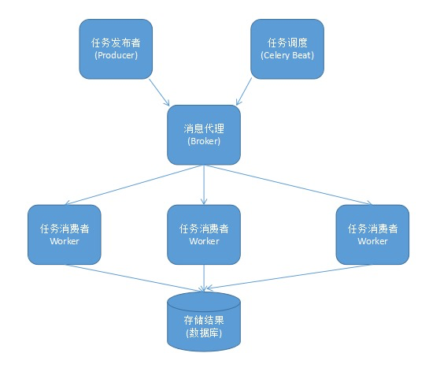

# 简介
- 分布式消息队列
- 可以实时处理，也可以任务调度
- 可以异步或同步

  
- Producer：调用了Celery提供的API、函数或者装饰器而产生任务并交给任务队列处理的都是任务生产者。
- Celery Beat：任务调度器，Beat进程会读取配置文件的内容，周期性地将配置中到期需要执行的任务发送给任务队列。
- Broker：消息代理，又称消息中间件，接受任务生产者发送过来的任务消息，存进队列再按序分发给任务消费方（通常是消息队列或者数据库）。Celery目前支持RabbitMQ、Redis、MongoDB、Beanstalk、SQLAlchemy、Zookeeper等作为消息代理，但适用于生产环境的只有RabbitMQ和Redis, 官方推荐 RabbitMQ。
- Celery Worker：执行任务的消费者，通常会在多台服务器运行多个消费者来提高执行效率。
- Result Backend：任务处理完后保存状态信息和结果，以供查询。Celery默认已支持Redis、RabbitMQ、MongoDB、Django ORM、SQLAlchemy等方式。

